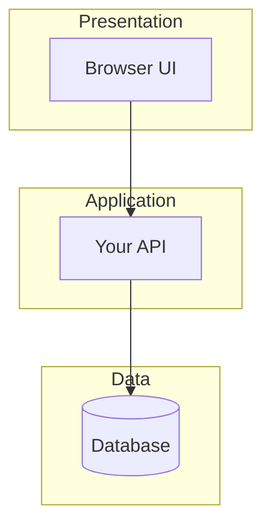

# Architecture

Models here are **diagrams-as-code**, kept in this repository and reviewed like
code, rather than as standalone UML documents. Mermaid renders directly on
GitHub, so a diagram in this file stays readable without any tooling. Flowchart
syntax, including `subgraph` for layers, is documented at
<https://mermaid.js.org/syntax/flowchart.html>.

## Layers

<How your system decomposes into layers, and what each layer is responsible
for. See Engineering Software Products Figures 4.10 and 4.11. Use one
`subgraph` per layer, named for the concern it owns. Replace the example
below.>

## Qualities

<The non-functional qualities you decided matter most, per Table 4.2 and
Figure 4.4, and what you traded away to get them.>

## Decisions

<Record the decisions worth remembering, and what you rejected. A design you
considered and dropped is often more informative than the one you kept, and
these notes are what a design defense draws on. Technology choices, per
Table 4.8, belong here too.>

| Decision | Alternatives considered | Why this one |
| --- | --- | --- |
| <decision> | <what else> | <reasoning> |
