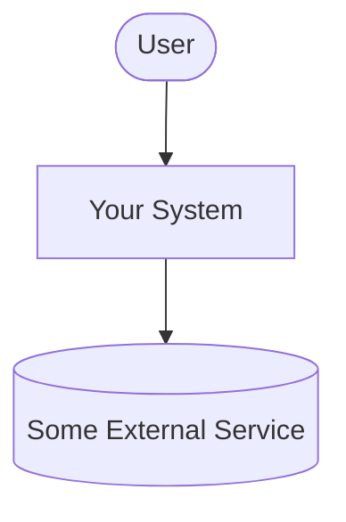
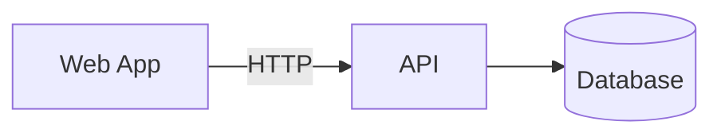

# Architecture

Models here are **diagrams-as-code**, kept in this repository and reviewed like
code, rather than as standalone UML documents. Mermaid renders directly on
GitHub, so a diagram in this file stays readable without any tooling.

## System Context

<Who and what does your system talk to? This is the C4 "context" level. Replace
the example below.>

## Containers

<The major runnable pieces and how they communicate. C4 "container" level.>

## Decisions

<Record the decisions worth remembering, and what you rejected. A design you
considered and dropped is often more informative than the one you kept, and
these notes are what a design defense draws on.>

| Decision | Alternatives considered | Why this one |
| --- | --- | --- |
| <decision> | <what else> | <reasoning> |
